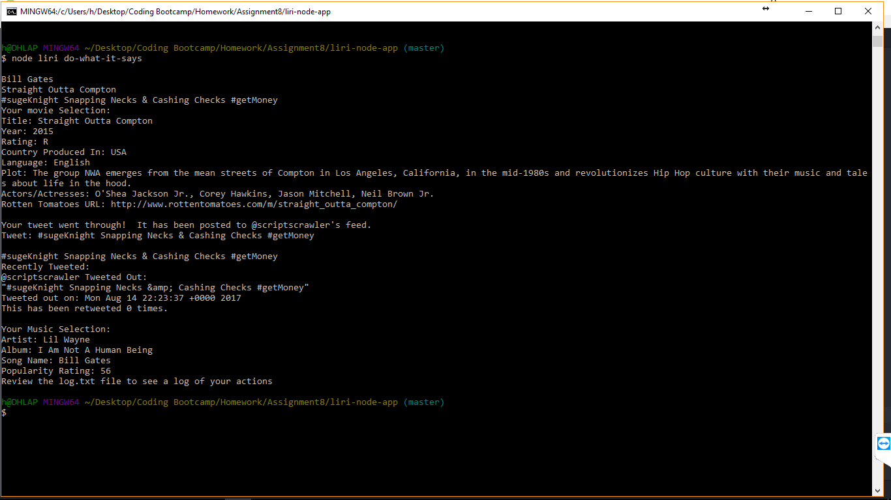

# liri-node-app

This will be a LIRI bot App created in Node.  It works in a similar manner to a 'SIRI' app but takes commands within the terminal.
Please see the below commands to determine the capabilities of the application.

Commands Accepted:

<<<<<<< HEAD
* node liri my-tweets <number of tweets to show>  - This command allows you to choose how many of the last tweets you want shown.
* node liri tweet-this  - Tweets out a random phrase.
* node liri movie-this  - Searches for a default movie and provides info about it.
* node liri movie-this <movie title> - Searches for a specific movie and provides info.
* node liri spotify-this-song  - Searches for a default song on spotify and displays results
* node liri spotify-this-song <song name>  - This searches for a specific song and displays results.
* node liri do-what-it-says  - This pulls prefilled text from a .txt file and uses that data to choose a movie, song, and to tweet out a random message, then show you that you actually did tweet it out.

Below you can see an example of the 'node liri do-what-it-says' command. It is reading a pre-filled text file to pull up a specific song, pull up a specific movie, and then tweet out a random tweet.  This gives you an idea of what this application is capable of.

=======
* node liri my-tweets <number of tweets to show>  - This command allows you to choose how many of the last tweets you want shown. 
* node liri tweet-this  - Tweets out a random phrase. 
* node liri tweet-this <tweet message>  - This command allows you to send out a tweet from @scriptscrawler. 
* node liri movie-this  - Searches for a default movie and provides info about it. 
* node liri movie-this <movie title> - Searches for a specific movie and provides info. 
* node liri spotify-this-song  - Searches for a default song on spotify and displays results 
* node liri spotify-this-song <song name>  - This searches for a specific song and displays results.. 
* node liri do-what-it-says  - This pulls prefilled text from a .txt file and uses that data to choose a movie, song, and to tweet out a random message, then show you that you actually did tweet it out. 
>>>>>>> 9fffdef96c2571351792a6c87e71423a483863fa

Side note - To be able to use this app, if you wanted to fork it and use it for yourself then you will have to insert your keys for Twitter and Spotify.

Technologies used:
Node, NPM Packages, API's, Javascript
